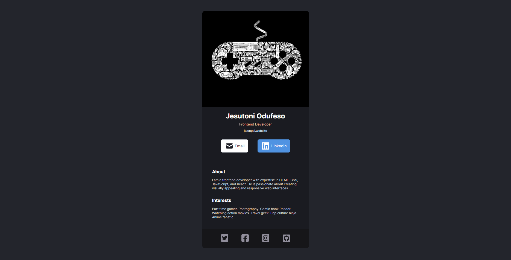

# Digital Business Card

This is a solo project given to me by [Scrimba](https://scrimba.com/learn/learnreact).

## Details

In the project, I was instructed to make a Digital Business Card with the given design in mind in [Figma](https://www.figma.com/file/4ctPLUvIn5b5Ep6YPOZWWd/Digital-Business-Card?type=design&node-id=0-1&t=016PyFIDmZbmqw7D-0) while meeting certain requirements:

- Build from scratch!
- Fill in your own information
- Seperate components for:
  - Info (photo, name, buttons, etc)
  - About
  - Interests
  - Footer

## Screenshot

